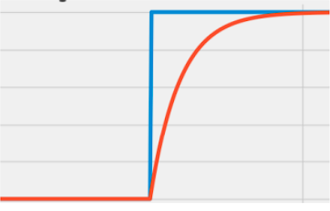
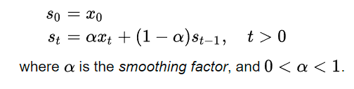
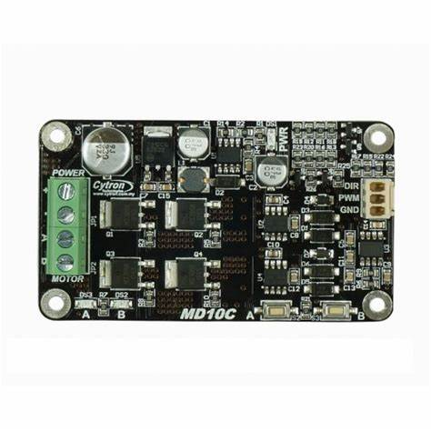

# Cytron Cleaner

### What this code does:
-   This code reads a signal from a potentiometer to then convert this signal to a PWM signal to be transferred to the Cytron Driver.

-   Before being passed to the Cytron Driver the signal is first passed through an exponential smoothing filter.

### What is an exponential smoothing filter:
-   It is a filter that simply decreases the rate at which a signal is conveyed. For example:

-   This can help when operating amotor to have the motor have a smoother start and stop.

-   This filter can be executed by using the following equation:

### Cytron Driver
-   The cytron driver operate a motor connected to it using 2 pins, one for direction (DIR), and the other for power (PWM)

-   It also has 3rd pin for ground so it can have a common ground with the system

-   A motor can then be connected to slots A and B and a battery or power supply can be connected to slots + and -

