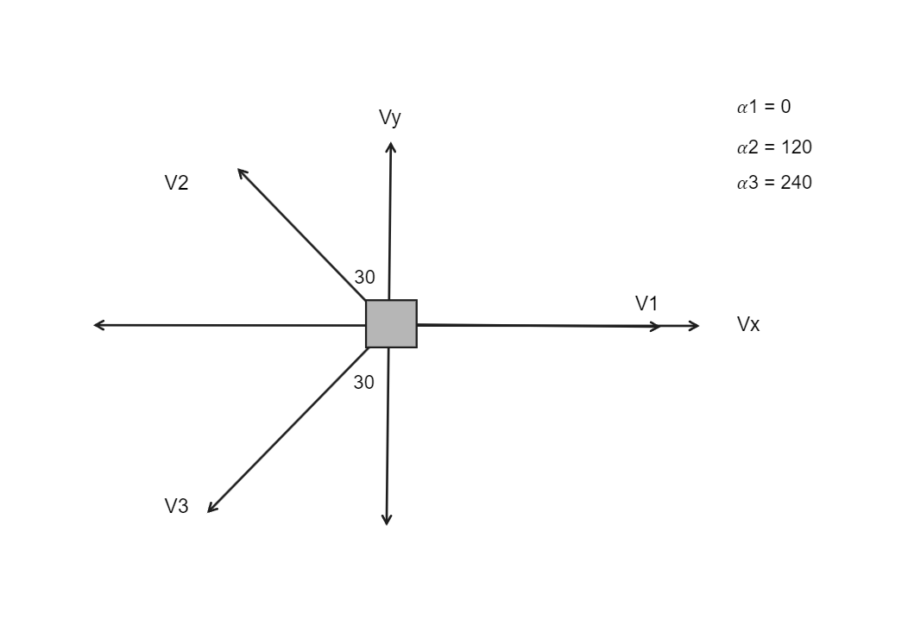
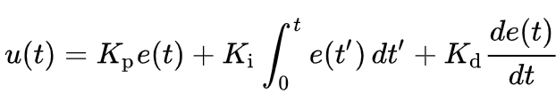

# Hero Of Mobility

## Kinematics

Omnidirectional is defined as simply being able to move 
any direction. The occupied robotic space consists of three 
dimensions in mobile robots: the x, y (point position on the 
robot) and the ω (robot orientation). Using 
omnidirectional motion method in geometry robotics as 
shown in Figure 1. The robot can move in any direction 
irrespective of position and orientation, so that the linear 
angular velocity 𝑉𝑥 and 𝑉𝑦 can be generated simultaneously. 

For the robot -considered as a particle- as shown in Figure 2. the x and y components of 
the orientation of the robot are described as:

V1 * cos( 𝛼1 ) - V2 * sin( 𝛼2 ) - V3 * sin( 𝛼3 ) = Vx

V1 * sin( 𝛼1 ) + V2 * cos( 𝛼2 ) - V3 * cos( 𝛼3 ) = Vy

V1              +       V2        +         V3      = R * w

Assuming that the angle between each wheel is 120 degrees and first wheel lies on the `X axis`.

- From the Assumption, we build the matrix from the coefficients of `sin` and `cos`.

- Solve the matrix equation using `Linear Algebra` to get the vector V which has the velocity of each wheel.

## Global Frame VS Local Frame

Global Frame: This is a chosen coordinate frame with a known origin. Usually, the origin is with respect to something like a GPS origin, Image origin, or Field corner. It’s also referred to as the world fixed frame. For example, a static manipulator usually has the origin of its coordinate system at its base.

Local Frame: This is a frame within the global frame that the robot exists in. Everything the robot measures is in this frame. 

To convert from local frame to global frame we used the rotation matrix, as multiplying these matrix to local vector produce the global vector and then use the same functionality to get the velocities of each wheel

## How the PID control system works

### Proportional (P) Control:

The proportional control component is directly proportional to the current error, which is the difference between the desired setpoint and the current state. It provides a control signal that is proportional to how far the system is from the desired state.

### Integral (I) Control:

The integral control component takes into account the cumulative sum of past errors over time.
It helps to eliminate steady-state error, which is the constant error that remains even after the proportional control is applied.

### Derivative (D) Control:

The derivative control component is based on the rate of change of the error.
It helps to dampen rapid changes in the control signal, reducing overshoot and oscillation.

The PID system can then return a value after passing through a similar equation such as the following:

Where:

-   U(t) is the control signal at time 

-   e(t) is the error at time t (the difference between the desired setpoint and the current state)

-   Kp is the proportional gain.

-   Ki is the integral gain.

-   Kd is the derivative gain.

-   ∫ e(t)dt represents the integral of the error from the initial time 0 to the current time t. 

-   de(t)/d(t) represents the derivative of the error with respect to time.

## How this program works:
-   Position is taken in.

-   Vx, Vy and omega are calculated using PID and then integrated to obtain change in position.

-   Also using Vx, Vy and omega, motor speed 1, 2 and 3 are calculated
