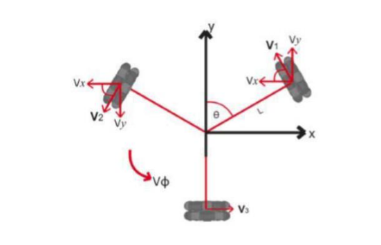
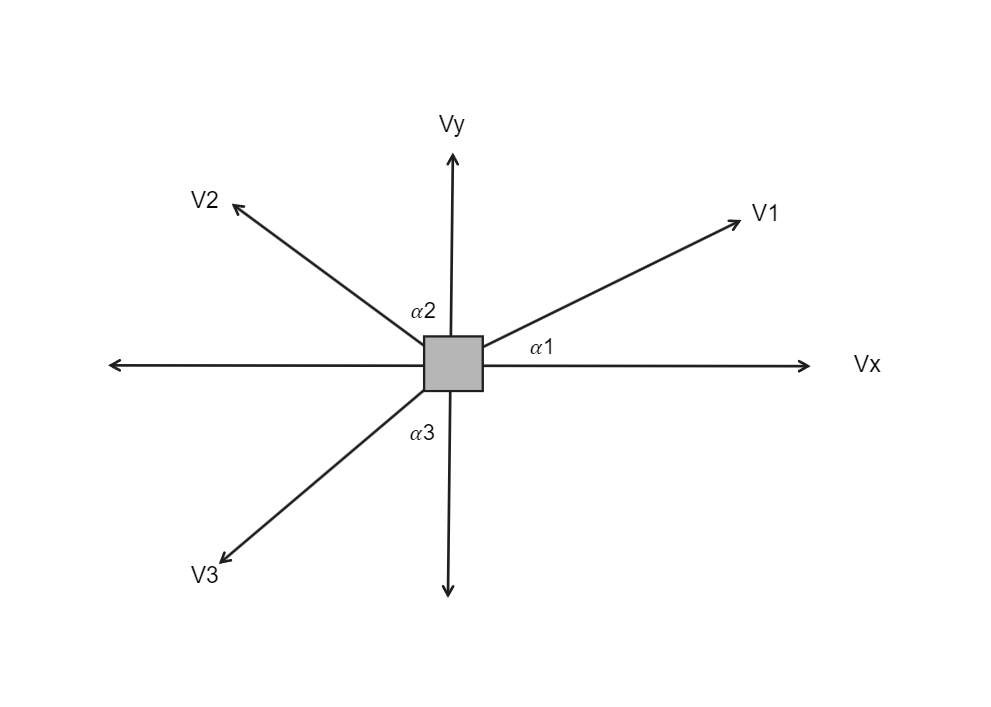

# Hero Of Mobility

## Kinematics

Omnidirectional is defined as simply being able to move 
any direction. The occupied robotic space consists of three 
dimensions in mobile robots: the x, y (point position on the 
robot) and the ω (robot orientation). Using 
omnidirectional motion method in geometry robotics as 
shown in Figure 1. The robot can move in any direction 
irrespective of position and orientation, so that the linear 
angular velocity 𝑉𝑥 and 𝑉𝑦 can be generated simultaneously. 

For the robot -considered as a particle- as shown in Figure 2. the x and y components of 
the orientation of the robot are described as:

V1 * cos( 𝛼1 ) - V2 * sin( 𝛼2 ) - V3 * sin( 𝛼3 ) = Vx

V1 * sin( 𝛼1 ) + V2 * cos( 𝛼2 ) - V3 * cos( 𝛼3 ) = Vy

V1              +       V2        +         V3      = R * w

- After generalizing the matrix we use the coefficients of `sin` and `cos` to get the matrix.

- Solve the matrix equation using `Linear Algebra` to get the vector V which has the velocity of each wheel.

## Global Frame VS Local Frame

Global Frame: This is a chosen coordinate frame with a known origin. Usually, the origin is with respect to something like a GPS origin, Image origin, or Field corner. It’s also referred to as the world fixed frame. For example, a static manipulator usually has the origin of its coordinate system at its base.

Local Frame: This is a frame within the global frame that the robot exists in. Everything the robot measures is in this frame. 

To convert from local frame to global frame we used the rotation matrix, as multiplying these matrix to local vector produce the global vector and then use the same functionality to get the velocities of each wheel.
